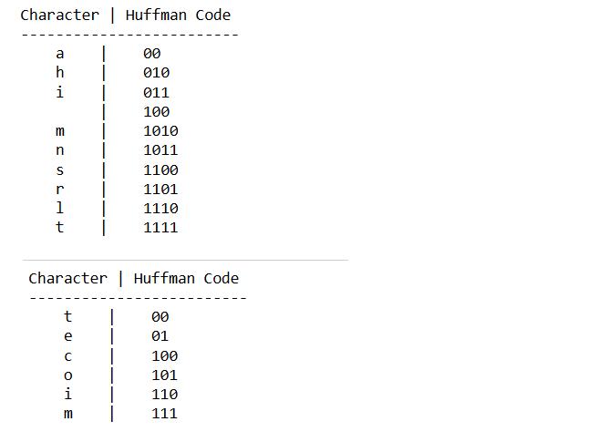

# Huffman-Coding
## Aim
To implement Huffman coding to compress the data using Python.

## Software Required
1. Anaconda - Python 3.7

## Algorithm:
### Step1:
Get the input string.

### Step2:
Create tree nodes.

### Step3:
Main function to implement huffman coding.

### Step4:
calculate frequency of occurence.

### Step5:
print the characters and its huffmancode.


## Program:
# NAME : ARUN KUMAR B
# RES.NO : 212223230021

``` Python
# expt-11-huffman coding

# Step 1: Get the input string
input_string = "mani sri latha"  # Example input string
# Step 2: Calculate frequency of each character in the input string
frequency = {}
for char in input_string:
    if char in frequency:
        frequency[char] += 1
    else:
        frequency[char] = 1
# Step 3: Create tree nodes
nodes = [[char, freq] for char, freq in frequency.items()]
# Step 4: Main function to implement Huffman coding
while len(nodes) > 1:
    # Sort nodes based on frequency
    nodes = sorted(nodes, key=lambda x: x[1])

    # Pick two smallest nodes
    left = nodes.pop(0)
    right = nodes.pop(0)

    # Create a new node with combined frequency
    new_node = [[left, right], left[1] + right[1]]
    nodes.append(new_node)

# The final node is the Huffman tree
huffman_tree = nodes[0]
# Step 5: Generate Huffman codes
huffman_codes = {}

def generate_codes(tree, code=""):
    if isinstance(tree[0], str):  # If it's a leaf node
        huffman_codes[tree[0]] = code
    else:  # If it's an internal node, recurse
        generate_codes(tree[0][0], code + "0")
        generate_codes(tree[0][1], code + "1")

generate_codes(huffman_tree)
# Step 6: Print the characters and their Huffman codes
print("Character | Huffman Code")
print("-------------------------")
for char, code in huffman_codes.items():
    print(f"    {char}    |    {code}")
```
## Output:
### Print the characters and its huffmancode



## Result
Thus the huffman coding was implemented to compress the data using python programming.
